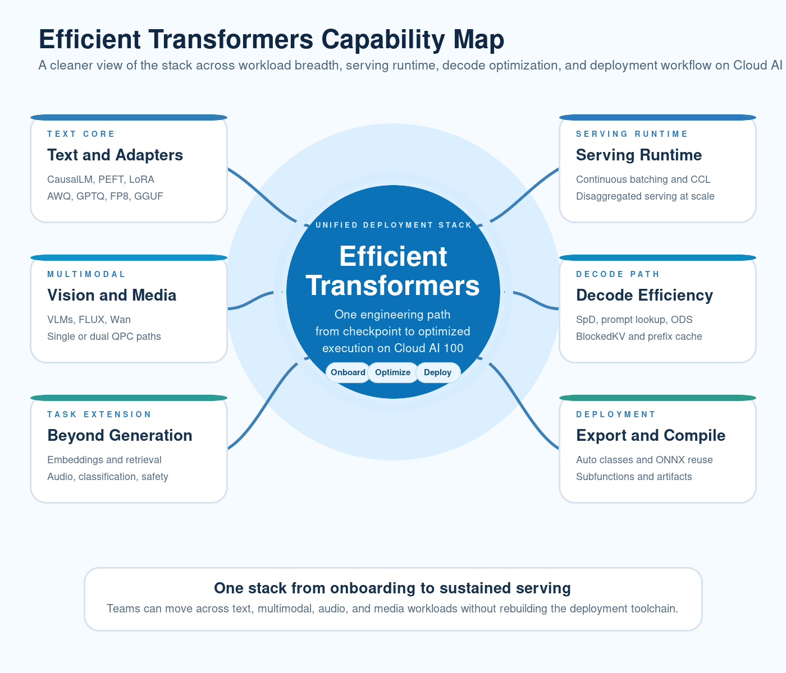
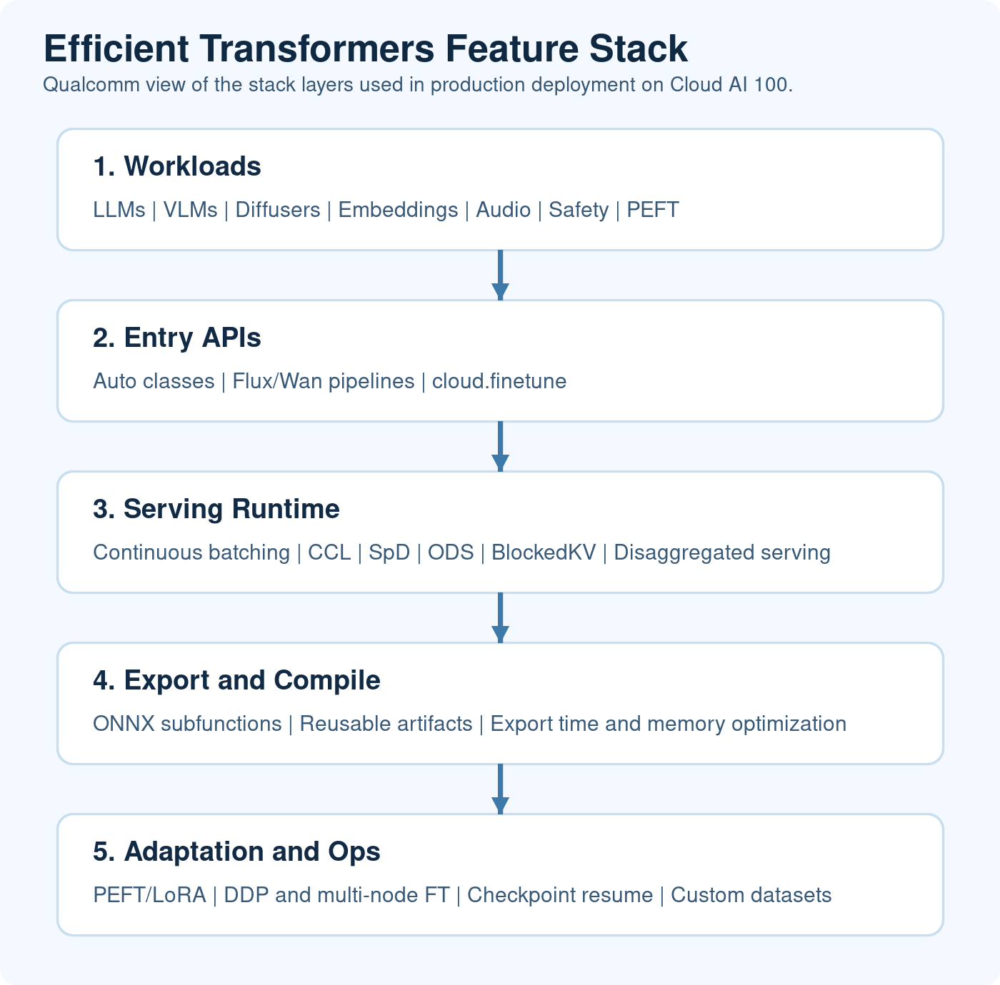

# Efficient Transformers: One Stack for Text, Multimodal, Audio, and Media on Cloud AI 100

When we introduced Efficient Transformers, the pitch was simple: take a model from Hugging Face, apply the changes needed for Cloud AI 100, and make deployment easier. That is still the job of the library. What has changed is the scope.

Most deployments no longer stop at text generation. A single application may need a chat model, embeddings for retrieval, a vision-language model for image understanding, a safety classifier, speech recognition, and sometimes an image or video generation pipeline. If each of those needs a different toolchain, the operational cost adds up quickly.

Efficient Transformers has grown into something broader: one stack that can cover those workloads while keeping the same basic flow from model checkout to optimized execution.



## A Wider Set of Workloads Without a New Workflow Each Time

Text generation is still the center of gravity. `QEFFAutoModelForCausalLM` remains the main entry point for LLMs, and the supported model set now includes families such as Llama 3.x, GPT-OSS, Qwen3-MoE, Gemma, Granite, Mixtral/Codestral, OLMo2, Molmo, SwiftKV, and Grok-1.

But the library no longer stops there. The public API now also covers:

- `QEFFAutoModelForImageTextToText` for vision-language models
- `QEFFAutoModel` for embeddings
- `QEFFAutoModelForSpeechSeq2Seq` and `QEFFAutoModelForCTC` for speech workloads
- `QEFFAutoModelForSequenceClassification` for classification and safety checks
- `QEffFluxPipeline`, `QEffWanPipeline`, and `QEffWanImageToVideoPipeline` for image and video generation
- `QEffAutoPeftModelForCausalLM` and `QEffAutoLoraModelForCausalLM` for adapter-based customization

That broader API surface matters for a simple reason: teams rarely deploy one model in isolation anymore. It is much more common to mix several of these workloads in the same product.

We have also expanded validated model coverage in ways that line up with how the ecosystem moved over the past year. That includes Llama 4 Scout, Gemma3, Qwen2.5-VL, Mistral 3.1, InternVL, Whisper, Wav2Vec2, FLUX.1-schnell, and Wan 2.2, along with newer text-model onboarding across GPT-OSS, Qwen3-MoE, and OLMo2.

## Serving Features That Matter Once the Model Is Already Running

Getting one prompt through a model is not the hard part. The harder part is keeping serving practical when request patterns, context length, and model size start to look like production rather than a demo.

That is where a lot of the recent work in Efficient Transformers has gone. Continuous batching is part of the main runtime path, including vision-language scenarios. CCL lets prefill and decode behave differently for long-context workloads. Speculative decoding support has grown beyond a single path and now includes draft-based SpD, prompt-lookup decoding, and multi-projection-head flows. On-device sampling and guided decoding reduce host-device chatter. BlockedKV and shared-prefix caching help on the decode side. And for larger deployments, disaggregated serving gives teams a cleaner way to split prefill and decode.

The same runtime depth now shows up in multimodal execution as well. Vision-language models support single-QPC and dual-QPC deployment, multi-image handling, and continuous batching. That is the kind of detail that decides whether a feature is useful in practice or just nice to list in a release note.



## The Export and Compile Loop Is a Lot Less Painful

One of the quieter but more important changes is how much work has gone into the path between "this model looks interesting" and "this model is ready to benchmark."

If that loop is slow or fragile, model evaluation drags. If it is memory-hungry, large models become harder to iterate on. If it is too manual, every new onboarding feels like a separate project.

Recent work in Efficient Transformers focused heavily on that part of the stack. ONNX subfunctions reduce repeated structure in supported export flows. Existing ONNX and QPC artifacts can be reused, which cuts down reruns. Memory profiling and export diagnostics make it easier to understand where large-model export is going wrong. There has also been steady work on ONNX transforms and large-model export behavior to reduce memory pressure, improve stability, and shorten the time spent in export and compile.

These are not the flashy features that show up first in a screenshot, but they are the changes engineers notice immediately when they are trying several models back to back.

## Adaptation Is Part of the Story Too

The library is also much more useful now if the job is not just "run the base model."

Efficient Transformers already includes PEFT and adapter-oriented paths through dedicated auto classes, but the bigger change is that fine-tuning is no longer off to the side. `QEfficient.cloud.finetune` gives the stack a direct training path that works on QAIC or GPU, supports PEFT, scales from a single device to DDP and multi-node runs, resumes from checkpoints, and accepts custom dataset preprocessing when the built-in flows are not enough. Gradient accumulation and gradient checkpointing are there as well, which matters once context length or model size starts pushing memory harder than expected.

That closes an important gap in the workflow. Teams often shortlist a base model, get the serving path working, and then realize they still need a small domain adaptation pass or a lightweight instruction-tuning run before the model is ready. Keeping that step in the same stack is a lot cleaner than switching toolchains right in the middle of the job.

## A Few Concrete Examples

Here are four different workflows that now live under the same library.

### 1. Text generation with `QEFFAutoModelForCausalLM`

If you want the simplest text path, the basic inference example uses the same auto-class pattern that shows up throughout the library.

```bash
python examples/text_generation/basic_inference.py \
    --model-name Qwen/Qwen2-1.5B-Instruct \
    --prompt "Summarize the deployment stack" \
    --prefill-seq-len 32 \
    --ctx-len 128 \
    --generation-len 100 \
    --num-cores 16
```

### 2. Vision-language inference with a dual-QPC path

The same codebase can also run a multimodal flow where the vision encoder and language model are split across separate QPCs.

```bash
python examples/image_text_to_text/basic_vlm_inference.py \
    --model-name meta-llama/Llama-4-Scout-17B-16E-Instruct \
    --image-url "https://huggingface.co/datasets/huggingface/documentation-images/resolve/0052a70beed5bf71b92610a43a52df6d286cd5f3/diffusers/rabbit.jpg" \
    --query "Describe the image and explain the scene" \
    --kv-offload \
    --prefill-seq-len 128 \
    --ctx-len 3000 \
    --num-cores 16 \
    --num-devices 1
```

### 3. Diffusion with a native pipeline

Efficient Transformers now includes direct pipeline support for image and video generation as well.

```python
import torch
from QEfficient import QEffFluxPipeline

pipeline = QEffFluxPipeline.from_pretrained("black-forest-labs/FLUX.1-schnell")

output = pipeline(
    prompt="A laughing girl",
    height=1024,
    width=1024,
    guidance_scale=0.0,
    num_inference_steps=4,
    max_sequence_length=256,
    generator=torch.manual_seed(42),
    parallel_compile=True,
)

output.images[0].save("girl_laughing.png")
```

### 4. Fine-tuning with `QEfficient.cloud.finetune`

The fine-tuning path follows the same pattern: choose the model, point the run at the target device, and add the adaptation options you need.

```bash
python -m QEfficient.cloud.finetune \
    --device qaic:0 \
    --model_name "meta-llama/Llama-3.2-1B" \
    --use-peft \
    --output_dir ./meta-sam \
    --num_epochs 2 \
    --context_length 256
```

If you need to bring in your own preprocessing, the same CLI can switch to a custom dataset flow without changing the rest of the setup.

```bash
python -m QEfficient.cloud.finetune \
    --device qaic:0 \
    --model_name "meta-llama/Llama-3.2-1B" \
    --dataset custom_dataset \
    --dataset_config data_config.json \
    --output_dir ./meta-sam-custom
```

And if the job needs to scale past a single card, the DDP path stays in the same interface as well.

```bash
QAIC_VISIBLE_DEVICES=0,1,2,3 torchrun --nproc-per-node 4 -m QEfficient.cloud.finetune \
    --device qaic \
    --enable_ddp \
    --num_epochs 2 \
    --model_name "meta-llama/Llama-3.2-1B"
```

If you want the same flow on GPU, the CLI still stays the same and only the device target changes.

Taken together, these examples say more than a long feature table does. The library is not just an LLM porting path anymore. It has become the common layer for text, multimodal, speech, retrieval, media workloads, and model adaptation on Cloud AI 100.

## Closing

The biggest difference from the first version of this story is not just the length of the supported-model list. It is that Efficient Transformers now feels more like a full deployment stack.

It covers more workloads. It has deeper runtime behavior where serving teams actually need it. The export and compile loop is better. And the adaptation story is stronger than it was before.

If you are building on Cloud AI 100, that combination matters. It means you can change the model, change the modality, or change the serving shape without having to change the entire workflow around it.

## Learn More

- [Quick Start](quick_start.md)
- [Validated Models](validate.md)
- [QEFF Auto Classes](qeff_autoclasses.md)
- [Diffuser Classes](diffuser_classes.md)
- [Fine-tuning Guide](finetune.md)
